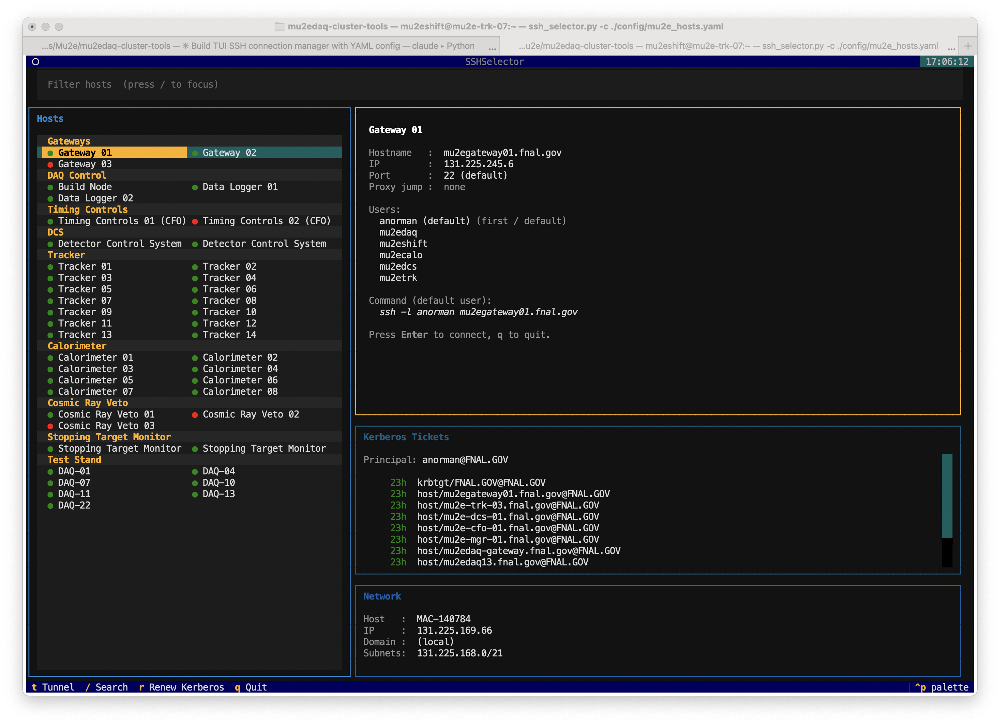

# mu2edaq-cluster-tools

Do you get lost trying to navigate all the nodes in your DAQ cluster (maybe because the naming is inconsistent or they are behind various gateways and firewalls, or someone moves them from one area to another?)  I do.  So to try and make it easier to find and work with different nodes I put together this remote commander program.  Think of it as late '90 meets what we need to do today.



The program is a simple terminal-based SSH host selector for managing connections to a fleet of remote hosts.  The toplogy of the cluster that it's managing is all specified in simple configuration files.  It's designed to be keyboard driven, so you can quickly navigate around and get to a login shell on one of the hosts.  It's written in python and configured w/ yaml, and it runs pretty much anywhere.

For people who like this kind of thing, it's built with [Textual](https://github.com/Textualize/textual) for the TUI experience (yes I've moved up in the world from good old ncurses).

## Why use it?

Question: Why should I use this instead of just relying on my ssh configuration file?

You can use your ssh config file.  In fact you still need it to setup certain types of settings.  What this is doing is saving you a lot of typing and a lot of "getting it wrong" situations.  Starting a tunnel has a bunch of syntax which I tend to get wrong, hostnames which alternate between hyphens and underscores always get messed up, remembering what is behind what firewalls, or what users you need to be get messed up all the time.

So instead this is a quick picker that gets it right most of the time.

## Features

What does it do?

- **Organized Hosts Lists** — hosts are organized into named groups with configurable display orders
- **Searchable Hosts Lists** - the hosts lists are searchable/filterable (which you want if you have 200+ hosts like say NOvA)
- **Two-column layout** — hosts are displayed side by side for compact browsing; use left/right arrows to select within a row
- **Per-group and per-host configuration** — groups have common config settings that can be overridden by per host testtings (i.e. all tracker nodes use the same jump host and user list, but one special node that got pulled out to lab 3 uses a different jump proxy) 
- **Multiple users per host** — choose which user you are using for a connection from a list of configured users
- **Host DNS resolution on startup** — each host is resolved in the background; a green/red dot indicates reachability
- **Automatic proxy skip** — if the destination host is on the same local subnet as the client, the configured proxy jump is automatically bypassed
- **SSH tunnel mode** — open a port-forward tunnel (`ssh -N -L`) instead of an interactive shell; prompts for local and remote port numbers
- **Kerberos ticket panel** — displays active tickets with time-to-expiry color coding; `r` renews the principal via `kinit -R`
- **Network info panel** — shows local hostname, IP, domain, and detected subnets
- **Error Displays** — if a connection fails, the stderr output is displayed so you can debug it
- **Multiple config files** — auto-discovers `*.yaml` files in `./` and `./config/`; shows a picker when more than one is found

## Installation

Clone the repo and run the install script:

```bash
git clone https://github.com/Mu2e/mu2edaq-cluster-tools.git
cd mu2edaq-cluster-tools
./install.sh
```

This will:
- Copy the application to `~/.local/share/mu2edaq-cluster-tools/`
- Create a self-contained virtual environment there with all dependencies
- Install a `ssh-selector` launcher in `~/.local/bin/` (or `~/bin/` if that exists)

If `~/.local/bin` is not yet on your `PATH`, the script will tell you what to add to your shell config.

To uninstall:

```bash
./install.sh --uninstall
```

### Manual installation

If you prefer to manage the environment yourself, Python 3.10+ is required along with the packages listed in `requirements.txt`:

```bash
pip install -r requirements.txt
python ssh_selector.py
```

Kerberos support on Windows is limited — it works within WSL and from PowerShell if Kerberos is configured, but MIT Kerberos for Windows has compatibility issues with some terminal emulators.

## Usage

```bash
# Auto-discover config files in ./ and ./config/
python ssh_selector.py

# Specify a config file explicitly
python ssh_selector.py -c path/to/hosts.yaml
```

And of course you should setup a simple alias for this so that you can use it quickly.

### Key bindings

| Key | Action |
|-----|--------|
| `Enter` | Connect (interactive shell) |
| `t` | Open SSH tunnel (prompts for ports) |
| `/` | Filter host list |
| `r` | Renew Kerberos ticket (`kinit -R`) |
| `q` | Quit |
| `←` / `→` | Switch selected host within a two-column row |
| `Escape` | Clear search / dismiss modal |

## Configuration

Config files are YAML. There is a fully annotated config provided (See [`config/hosts.yaml.example`](config/hosts.yaml.example) for a fully annotated example), as well as a config for the MC-2 cluster.  I'll add one for the gpvms and other groups shortly.

The general format is fairly self documenting.

### Minimal example

```yaml
hosts:
  - hostname: myserver.example.com
    nickname: My Server
```

### Full structure

```yaml
# Ordered list of group names — controls display order in the TUI
grouplist:
  - Access
  - Backend

# Per-group defaults inherited by every host in the group
groups:
  Access:
    users:
      - default        # resolves to the current OS user at runtime
      - admin
  Backend:
    proxy_jump: gateway.example.com
    users:
      - default
      - deploy

hosts:
  - nickname: Jump Box
    hostname: gateway.example.com
    group: Access

  - nickname: DB Primary
    hostname: db1.internal.example.com
    group: Backend

  - nickname: Web Server
    hostname: web.example.com
    group: Backend
    port: 2222
    proxy_jump: null   # override group proxy — connect directly
    users:
      - deploy
      - default
```

### Host fields

| Field | Required | Description |
|-------|----------|-------------|
| `hostname` | yes | Address passed to `ssh` |
| `nickname` | no | Display name in the TUI (defaults to `hostname`) |
| `group` | no | Must match a `grouplist` entry |
| `port` | no | SSH port (default `22`) |
| `users` | no | List of users; first is the default. Overrides group default. |
| `proxy_jump` | no | ProxyJump host. Set to `null` to disable the group default. |

The special user value `"default"` resolves to the current OS user (`$USER`) at runtime.

### Group fields

| Field | Description |
|-------|-------------|
| `users` | Default user list for all hosts in the group |
| `proxy_jump` | Default ProxyJump for all hosts in the group |

## SSH tunnel mode

Press `t` on any host to open a port-forward tunnel instead of a shell. You will be prompted for:

- **Local port** — port on your machine to listen on
- **Remote port** — port on the destination host to forward to

The resulting command is `ssh -N -L <local>:localhost:<remote> [options] <host>`. Press `Ctrl+C` in the terminal to close the tunnel and return to the host selector.

## Kerberos support

The progam checks the kerberos cache for active tickets on startup.  The right panel shows active Kerberos tickets and then color-coded them based on their time till expiration  (and you can renew a ticket quickly from the interface which should help with the "Oh I forgot to renew my ticket" issues:

- **Green** — more than 2 hours remaining
- **Yellow** — less than 2 hours remaining
- **Red** — expired

Press `r` to renew the ticket principal via `kinit -R`. Tickets refresh automatically every 60 seconds.

## Other Stuff

Need more features?  Sure let me know. -AJN
